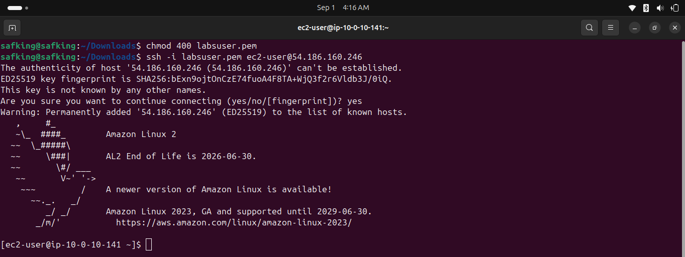
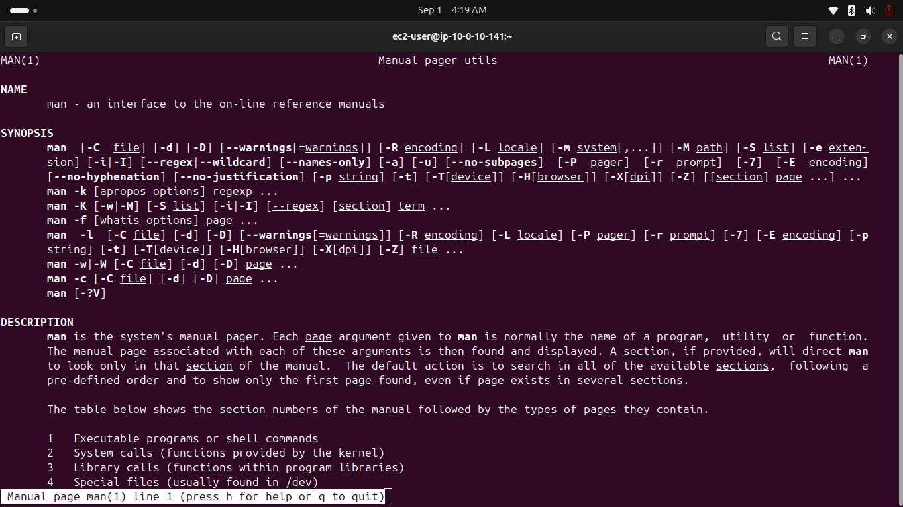
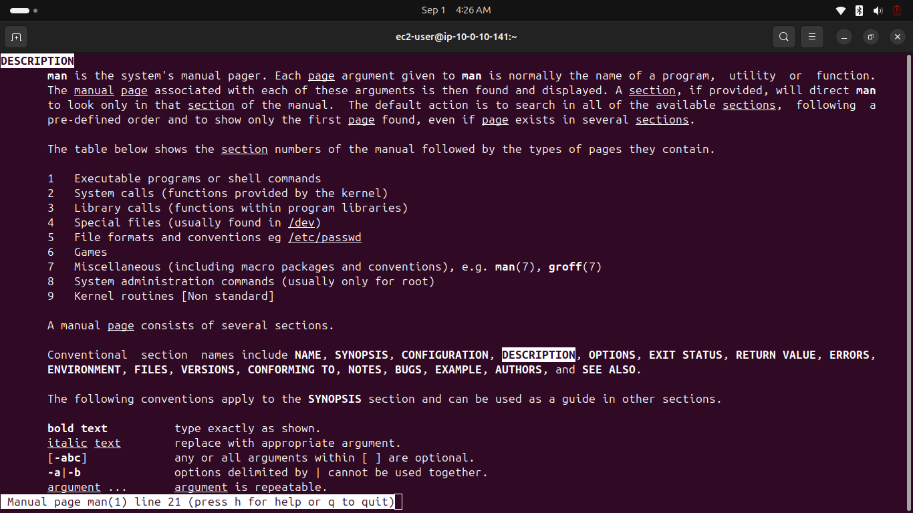

# Lab 225 — Introduction to an Amazon Linux AMI

**Module**: Linux
**Date**: 2026-09-01
**Objective**: Connect via SSH to an Amazon Linux instance and use the man help system.

## What I did

Connected via SSH to an Amazon Linux 2 instance using a `.pem` key pair.



Explored the structure of a man page with `man man`, identifying key sections (NAME, SYNOPSIS, DESCRIPTION).



Used the pager's search feature inside the man page with `/DESCRIPTION`, then moved to the next occurrence with `n`.



## Key commands
```bash
chmod 400 labsuser.pem
ssh -i labsuser.pem ec2-user@<public-ip>
man man
/DESCRIPTION
n
q
```

## Issue encountered
The lab instructions ask to "demonstrate the search feature of the man pages" without ever explaining how to use it. My first instinct was to open a different page (`man ls`), which is just a new lookup, not a search. The actual search feature is internal to the pager itself (`/keyword`, `n` for the next match).

## Fix
Looked into how the `man`/`less` pager works outside of the lab instructions, then used `/DESCRIPTION` inside `man man` to demonstrate the search.
