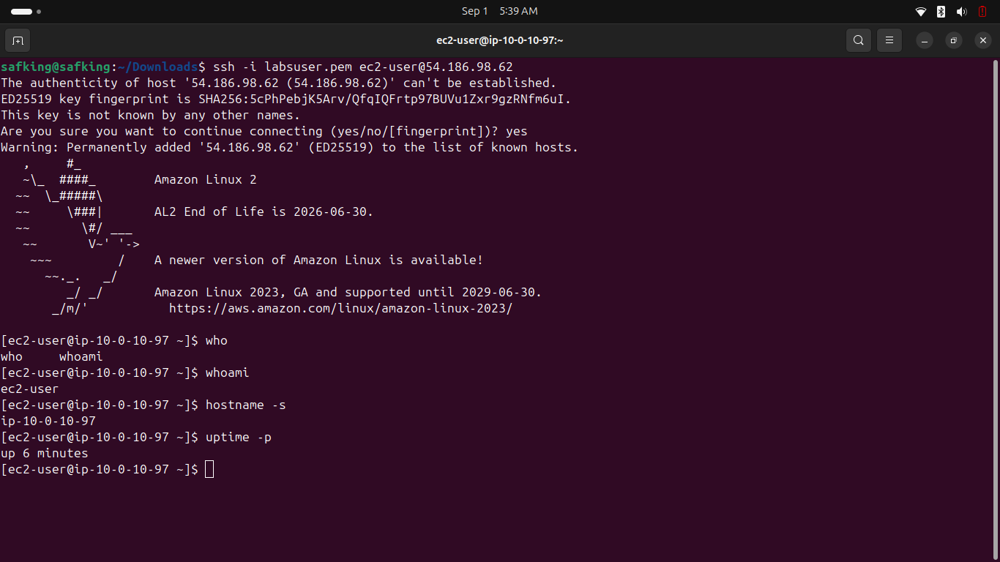
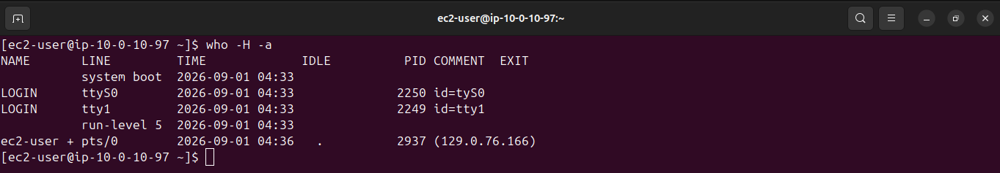
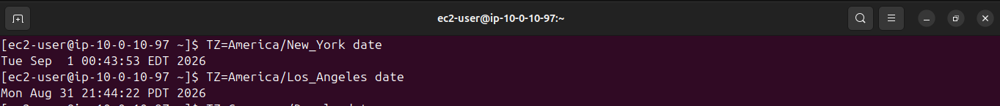
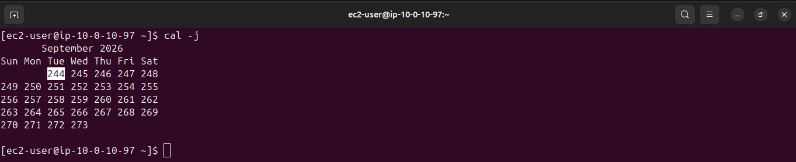
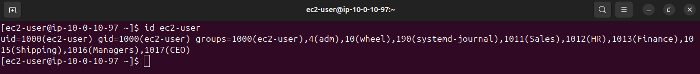
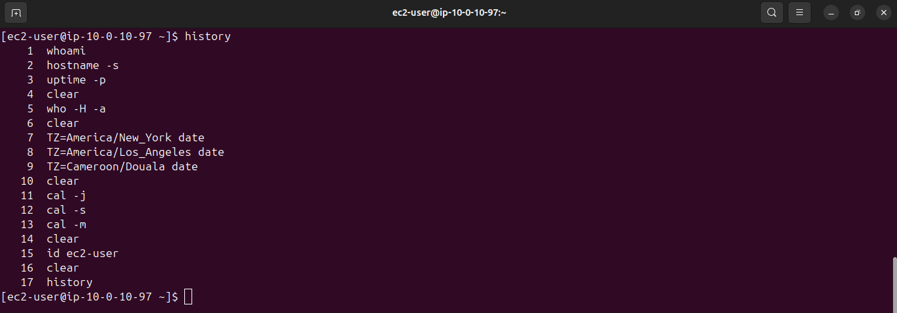
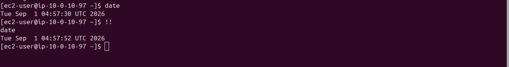

# Lab 227 — Linux Command Line

**Module**: Linux
**Date**: 2026-09-01
**Objective**: Run basic system/session commands and reuse previous bash commands through history and search.

## What I did

Connected via SSH, then ran `whoami`, `hostname -s`, and `uptime -p` to get basic session and system information.



Ran `who -H -a` to list logged-in users with detailed session info (line, time, idle, PID).



Checked the date in other timezones with `TZ=America/New_York date` and `TZ=America/Los_Angeles date`. Also tested `TZ=Cameroon/Douala date` out of curiosity, not part of the original instructions.



Displayed the current month in Julian format with `cal -j`, then compared alternate calendar views with `cal -s` and `cal -m`.



Checked user and group info with `id ec2-user`.



Viewed the session's command history with `history`.



Used `CTRL+R` to perform a reverse search on `TZ`, then executed the matched command directly.


Ran `date`, then reused it immediately with `!!`.



## Key commands
```bash
whoami
hostname -s
uptime -p
who -H -a
TZ=America/New_York date
TZ=America/Los_Angeles date
cal -j
cal -s
cal -m
id ec2-user
history
date
!!
```

## Issue encountered
The instructions say typing `whoa` and pressing Tab autocompletes to `whoami`. In practice, typing `who` and pressing Tab does not autocomplete directly, it lists two matches (`who` and `whoami`), since `who` is itself a valid command. Also, the instructions describe pressing Tab after a reverse search (`CTRL+R`) to edit the matched command before running it. In this session, the matched command (`TZ=America/Los_Angeles date`) was run directly with Enter, with no separate editing step shown.

## Fix
No fix needed, these are just differences between the written instructions and actual shell behavior, worth noting for future reference.
