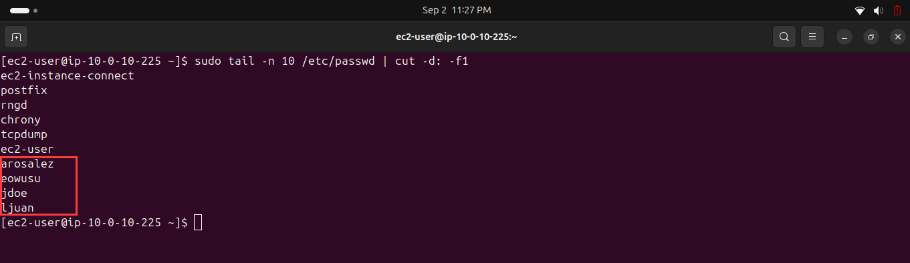
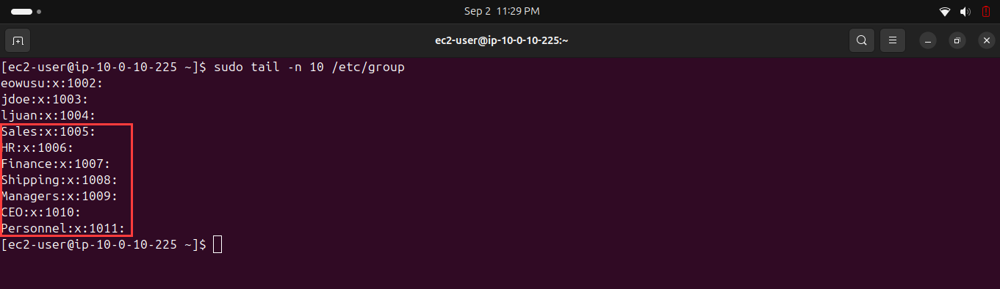
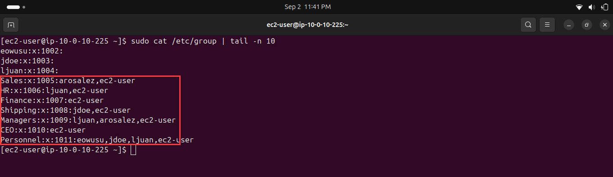
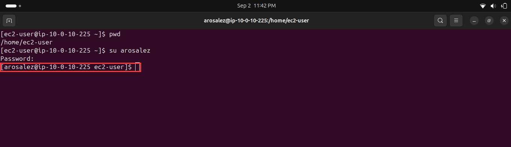
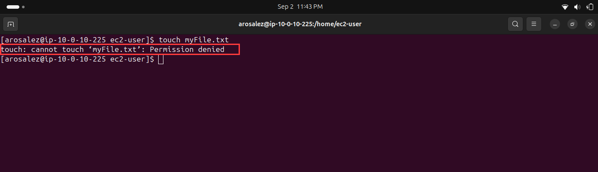
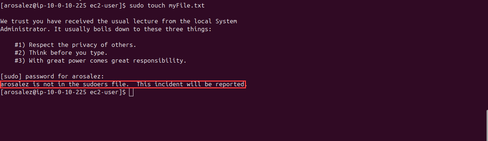
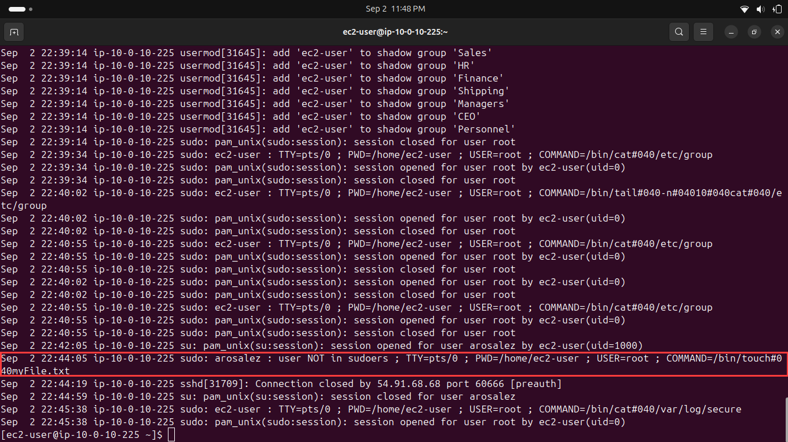

# Lab 229 — Managing Users and Groups

**Module**: Linux
**Date**: 2026-09-02
**Objective**: Create users and groups, assign users to groups, and observe permission and sudoers behavior when switching users.

## What I did

Created users (`arosalez`, `eowusu`, `jdoe`, `ljuan`) with `sudo useradd` and set their passwords with `sudo passwd`. Verified the created accounts with `sudo tail -n 10 /etc/passwd | cut -d: -f1`.



Created the groups `Sales`, `HR`, `Finance`, `Shipping`, `Managers`, `CEO`, and `Personnel` with `sudo groupadd`, then verified them with `sudo tail -n 10 /etc/group`.



Assigned users to their respective groups with `sudo usermod -a -G <group> <user>`, and added `ec2-user` to all groups. Verified the final memberships with `sudo cat /etc/group | tail -n 10`.



Switched to the `arosalez` user with `su arosalez`.



Attempted to create a file in the `ec2-user` home directory as `arosalez` with `touch myFile.txt`, which was denied due to lack of write permission.



Retried the same action with `sudo touch myFile.txt`, which was also denied since `arosalez` is not in the sudoers file.



Reviewed `/var/log/secure` with `sudo cat /var/log/secure` to see how the failed sudo attempt was logged.



## Key commands
```bash
sudo useradd <user>
sudo passwd <user>
sudo tail -n 10 /etc/passwd | cut -d: -f1

sudo groupadd <group>
sudo tail -n 10 /etc/group

sudo usermod -a -G <group> <user>
sudo cat /etc/group | tail -n 10

su arosalez
touch myFile.txt
sudo touch myFile.txt

sudo cat /var/log/secure
```

## Issue encountered
The group assignment table in the instructions is poorly formatted, entries like "Sales arosaleznwolf" concatenate multiple user IDs with no separator, making it unclear at first glance whether this is one user or several. Had to infer the intended split from context.

A second, unrelated observation from `/var/log/secure`: the log contained an OpenSSH `POSSIBLE BREAK-IN ATTEMPT!` warning tied to an incoming connection. This is not an actual intrusion, it is OpenSSH's standard warning when a client's reverse DNS does not match its forward DNS, which is common on mobile carrier networks. Worth remembering as a case of an alarming-looking log line that isn't actually a security incident.

## Fix
Interpreted the table entries by cross-referencing user IDs against the user table from Task 2. For the log warning, verified the cause was a DNS mismatch rather than treating it as a real break-in.
