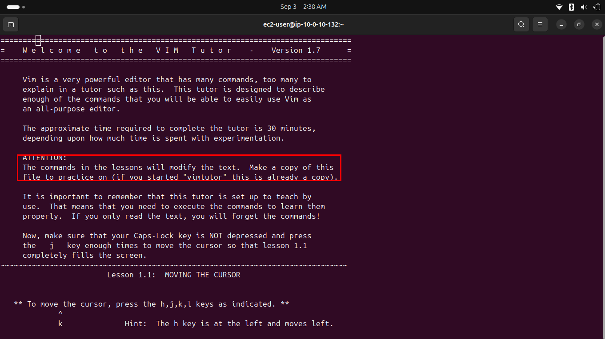
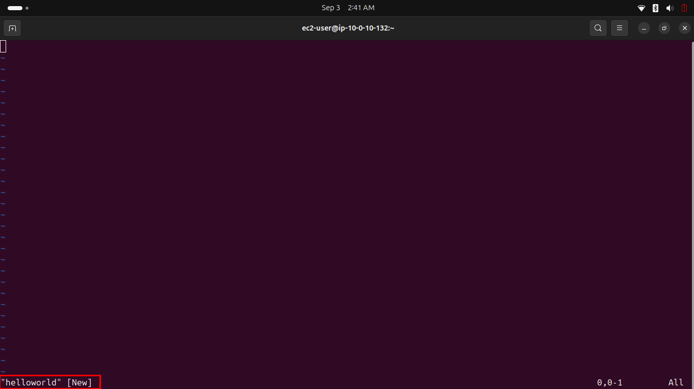
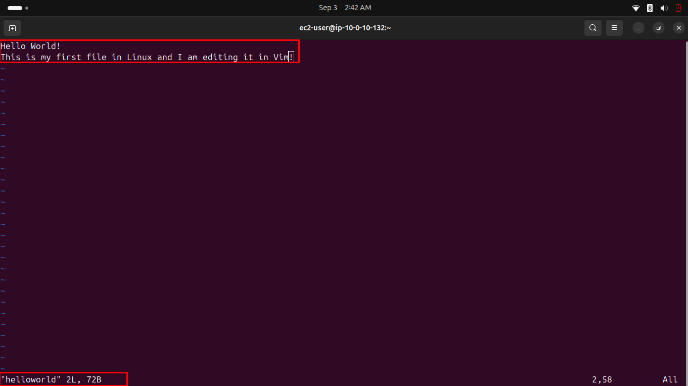
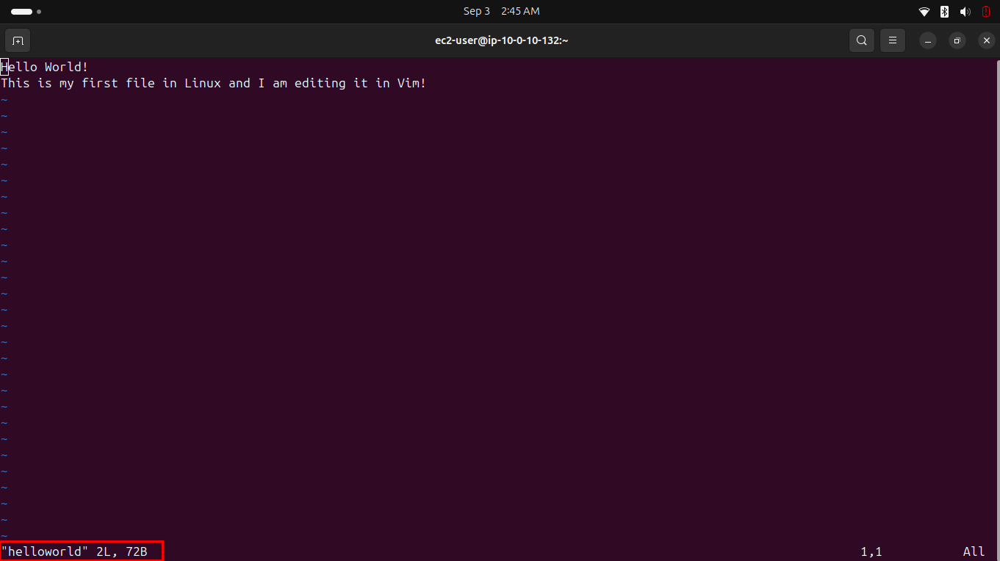
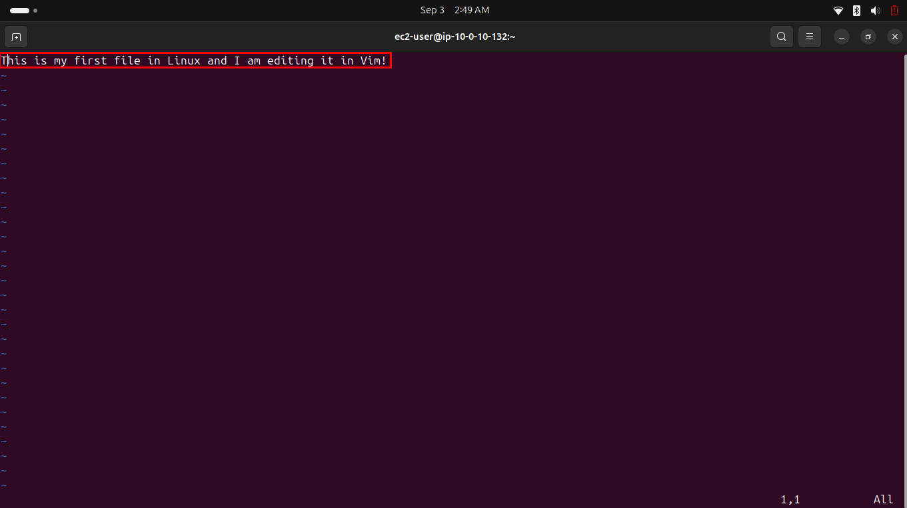
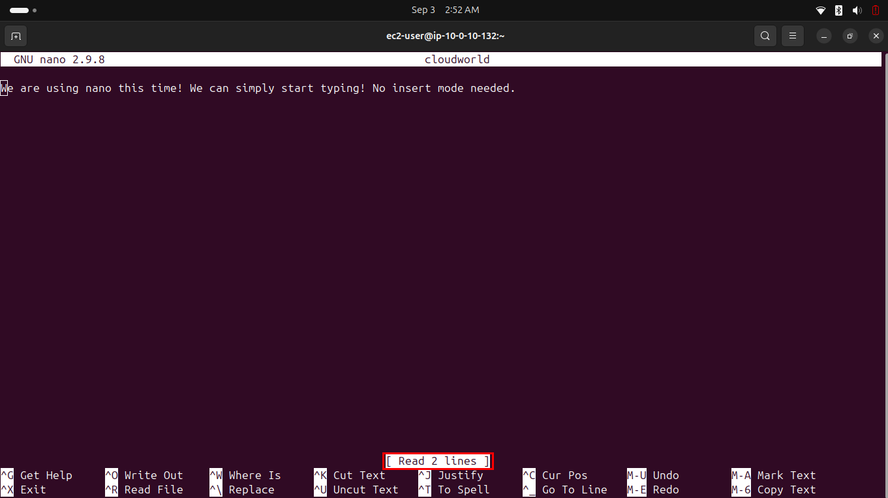

# Lab 231 — Editing Files in Linux

**Module**: Linux
**Date**: 2026-09-03
**Objective**: Learn basic text editing in Linux using Vim (via vimtutor and direct editing) and nano.

## What I did

Ran `vimtutor` and completed lessons 1 to 3, covering cursor movement and basic editing commands.



Created a new file with `vim helloworld`.



Entered insert mode with `i` and typed two lines of text, then saved and quit with `:wq`.



Reopened the file, added a third line in insert mode, then exited without saving using `:q!` instead of `:wq`. Reopening the file afterward confirmed the file still only contains 2 lines, `72B`, exactly as before, the third line was discarded since it was never written to disk.



Tried the additional challenge commands: `dd` to delete the first line, confirming only the second line remained.



Created and edited a file with `nano cloudworld`, typing text directly without needing an insert mode. Saved with `CTRL+O`, exited with `CTRL+X`, then reopened the file to confirm the content was saved.



## Key commands
```bash
vimtutor

vim helloworld
i
<Esc>
:wq

vim helloworld
i
<Esc>
:q!

dd
u
:w

nano cloudworld
# Ctrl+O to save, Ctrl+X to exit
```

## Issue encountered
The lab's stated objective mentions copying content from `/var/log/secure` and editing it with nano, but Task 4's actual instructions never reference `/var/log/secure`, they only have you type arbitrary text into a new file called `cloudworld`. The stated objective and the actual steps don't match.

## Fix
Followed the actual Task 4 instructions as written rather than the objective statement, since the instructions are the executable source of truth.
