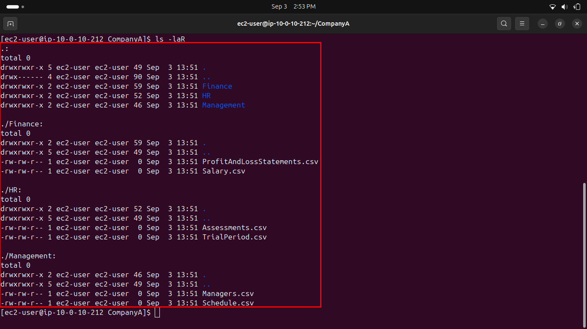
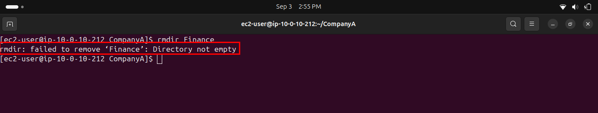
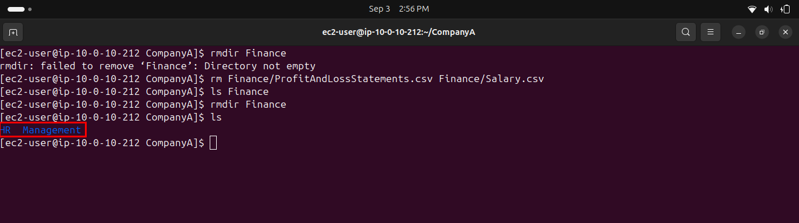
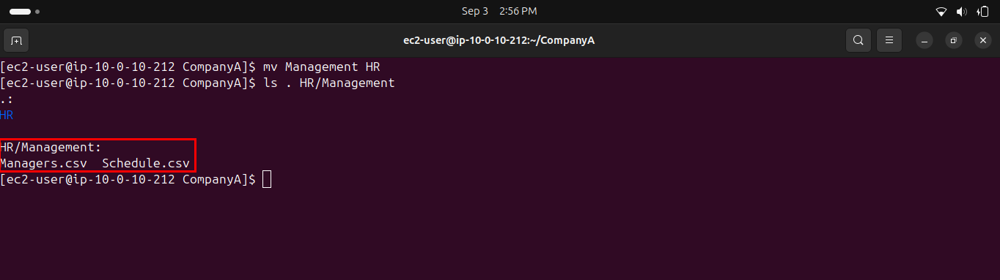
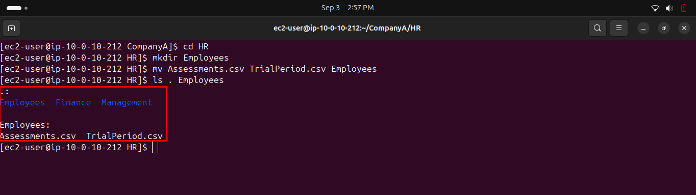

# Lab 233 — Working with the Linux File System

**Module**: Linux
**Date**: 2026-09-03
**Objective**: Create a folder structure, then reorganize it using copy, move, and delete operations.

## What I did

Created the `CompanyA` folder structure with `mkdir` and `touch`, then verified the full tree with `ls -laR`.



Copied the `Finance` folder and its content into `HR` with `cp -r`.


Attempted to remove the original `Finance` folder with `rmdir`, which failed since the folder still contained files.



Removed the files inside `Finance`, then successfully removed the empty folder with `rmdir`.



Moved the `Management` folder inside `HR` with `mv`.



Created an `Employees` folder inside `HR` and moved `Assessments.csv` and `TrialPeriod.csv` into it, then verified the final structure with `ls . Employees`.



## Key commands
```bash
mkdir CompanyA
cd CompanyA
mkdir Finance HR Management
touch HR/Assessments.csv HR/TrialPeriod.csv
touch Finance/Salary.csv Finance/ProfitAndLossStatements.csv
touch Management/Managers.csv Management/Schedule.csv
ls -laR

cp -r Finance HR
rmdir Finance
rm Finance/ProfitAndLossStatements.csv Finance/Salary.csv
rmdir Finance

mv Management HR
cd HR
mkdir Employees
mv Assessments.csv TrialPeriod.csv Employees
ls . Employees
```

## Issue encountered
The lab instructions contain a typo inconsistency: the initial folder structure lists the file as `Assessments.csvv` (double v), while a later example output in the same document shows it as `Assessments.cvs` (letters swapped). Neither spelling is correct, the actual valid name is `Assessments.csv`.

## Fix
Used the correct spelling `Assessments.csv` throughout, based on context rather than either flawed version in the instructions.
