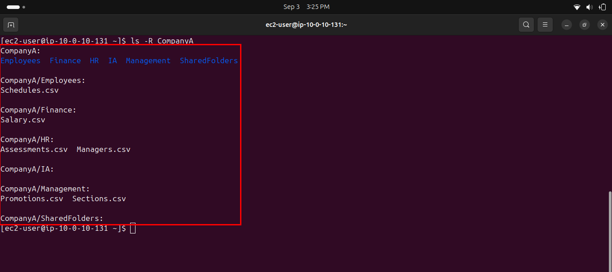
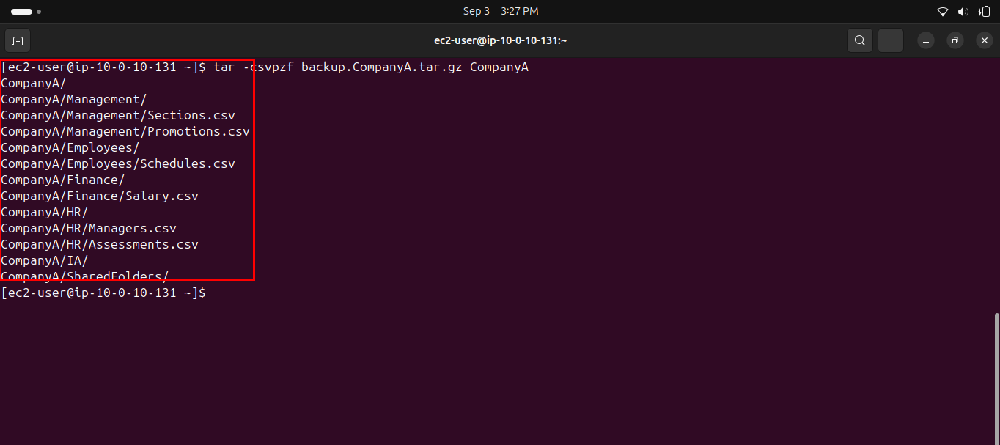
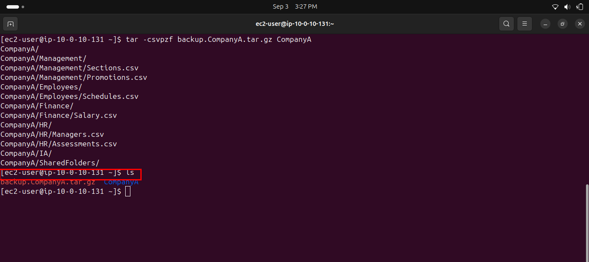
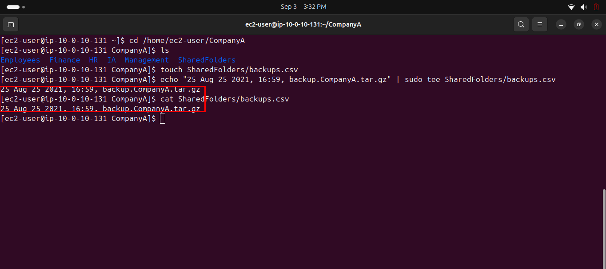
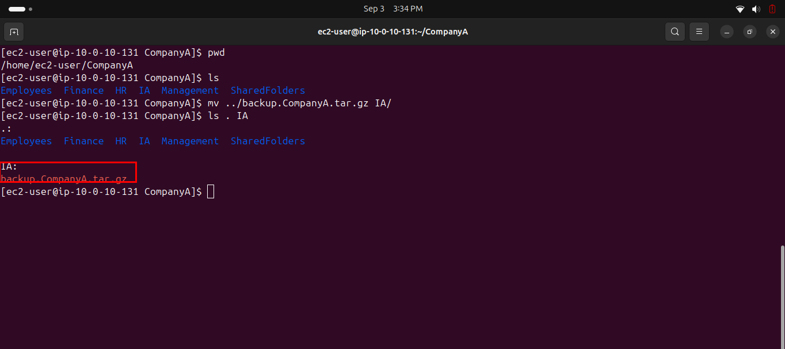

# Lab 235 — Working with Files

**Module**: Linux
**Date**: 2026-09-03
**Objective**: Create a tar backup of a folder structure, log the backup's creation, and transfer the backup file to another folder.

## What I did

Recreated the `CompanyA` structure (the instructions assumed it already existed) and verified it with `ls -R CompanyA`.



Created a compressed backup archive of the entire `CompanyA` folder with `tar -csvpzf`.



Verified the archive was created alongside the original folder with `ls`.



Logged the backup's date, time, and filename into `SharedFolders/backups.csv` using `echo` piped into `sudo tee`, then displayed the file with `cat` to confirm the entry.



Moved the backup archive into the `IA` folder with `mv`, then verified the transfer with `ls . IA`.



## Key commands
```bash
mkdir -p CompanyA/Employees CompanyA/Finance CompanyA/HR CompanyA/IA CompanyA/Management CompanyA/SharedFolders
touch CompanyA/Employees/Schedules.csv
touch CompanyA/Finance/Salary.csv
touch CompanyA/HR/Assessments.csv CompanyA/HR/Managers.csv
touch CompanyA/Management/Promotions.csv CompanyA/Management/Sections.csv

ls -R CompanyA

tar -csvpzf backup.CompanyA.tar.gz CompanyA
ls

cd CompanyA
touch SharedFolders/backups.csv
echo "25 Aug 25 2021, 16:59, backup.CompanyA.tar.gz" | sudo tee SharedFolders/backups.csv
cat SharedFolders/backups.csv

mv ../backup.CompanyA.tar.gz IA/
ls . IA
```

## Issue encountered
The instructions assume the `CompanyA` structure already exists in the environment ("Your work environment has the following folder structure"), but it had to be created from scratch first.

There's also a contradiction in how `SharedFolders` is treated: the initial structure diagram lists `SharedFolders.csv` as a file, but Task 3 treats `SharedFolders` as a folder (`touch SharedFolders/backups.csv`), and the `tar` output itself confirms it as a directory (`CompanyA/SharedFolders/`). Created it as a folder, matching what the rest of the lab actually requires.

Separately, the log date given in the instructions is internally inconsistent ("25 Aug 25 2021" repeats "25" in a confusing way), and the command example uses year 2021 while its own expected output shows 2019. Used the exact string provided in the instructions to stay consistent with the task, rather than second-guessing the format.

## Fix
Built the missing folder structure manually before proceeding. Interpreted `SharedFolders` as a directory based on the actual commands required, not the initial diagram.
