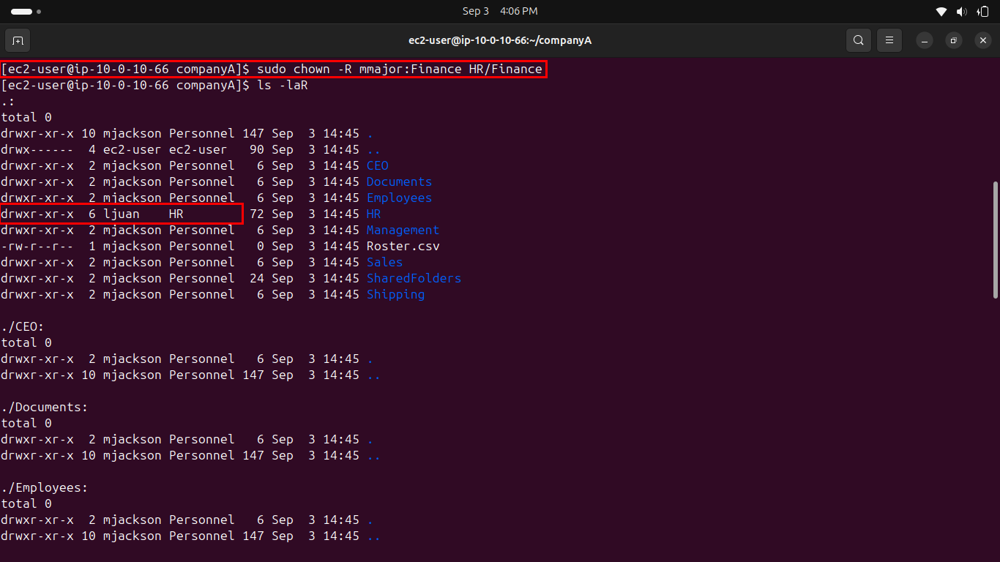
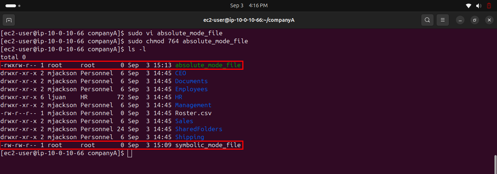
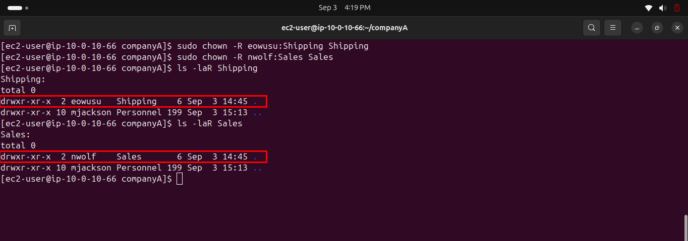

# Lab 237 — Managing File Permissions

**Module**: Linux
**Date**: 2026-09-03
**Objective**: Change ownership of a folder structure to specific users/groups, and modify file permissions using symbolic and absolute chmod modes.

## What I did

Changed ownership of `companyA` to `mjackson:Personnel`, `HR` to `ljuan:HR`, and `HR/Finance` to `mmajor:Finance` with `chown -R`, then verified the full structure with `ls -laR`.



Created `symbolic_mode_file` and `absolute_mode_file` with `vi`, then applied `chmod g+w` (symbolic mode) to the first and `chmod 764` (absolute mode) to the second. Verified both with `ls -l`.



Changed ownership of `Shipping` to `eowusu:Shipping` and `Sales` to `nwolf:Sales`, then verified both with `ls -laR`.



## Key commands
```bash
sudo chown -R mjackson:Personnel /home/ec2-user/companyA
sudo chown -R ljuan:HR HR
sudo chown -R mmajor:Finance HR/Finance
ls -laR

sudo vi symbolic_mode_file
sudo chmod g+w symbolic_mode_file

sudo vi absolute_mode_file
sudo chmod 764 absolute_mode_file
ls -l

sudo chown -R eowusu:Shipping Shipping
sudo chown -R nwolf:Sales Sales
ls -laR Shipping
ls -laR Sales
```

## Issue encountered
The instructions contain two name mismatches between the narrative text and the actual commands. Task 2 refers to the HR manager as "ctee" while the command uses `ljuan`. Task 4's figure caption refers to "eleonard" and "isteinke" as the Shipping and Sales managers, while the actual commands use `eowusu` and `nwolf`. Followed the executable commands in both cases, since they represent what was actually meant to run.

## Fix
Used `ljuan`, `eowusu`, and `nwolf` as given in the commands, ignoring the inconsistent names in the descriptive text.
