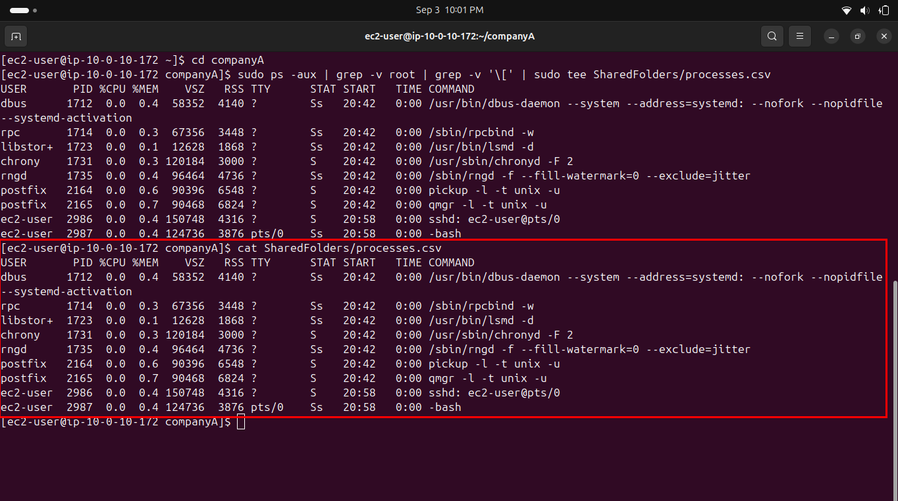
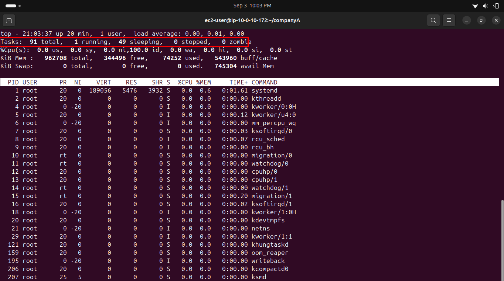
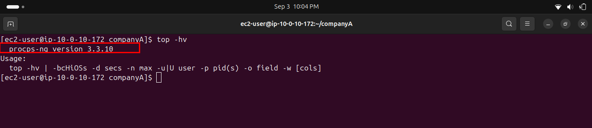
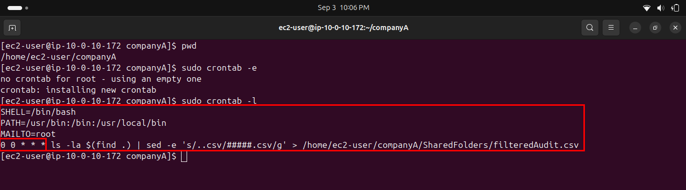

# Lab 239 — Managing Processes

**Module**: Linux
**Date**: 2026-09-03
**Objective**: Generate a filtered process log, observe system load with top, and schedule a daily audit with cron.

## What I did

Generated a filtered process log with `ps -aux`, excluding root-owned processes and kernel threads (identified by brackets in the command name), then verified the content with `cat`.



Ran `top` to observe real-time system activity. The `Tasks:` line showed 91 total tasks, with 1 in the `running` state, 49 `sleeping`, and 0 `stopped` or `zombie`.



Checked the installed version with `top -hv`.



Created a cron job via `sudo crontab -e` to run a daily audit script, then verified it with `sudo crontab -l`.



## `ps` vs `top`: two tools, two different jobs
Both commands are used to inspect running processes, but they serve different purposes. `ps` takes a single snapshot of the process table at the moment it's run, it prints its output once and returns to the prompt, which makes it well suited for logging, filtering with `grep`, and piping into files (like the `processes.csv` file created in this task). `top`, on the other hand, is interactive and refreshes continuously, showing live CPU and memory usage as they change, which makes it the right tool for actively monitoring system load rather than recording a fixed report.

## Key commands
```bash
sudo ps -aux | grep -v root | grep -v '\[' | sudo tee SharedFolders/processes.csv
cat SharedFolders/processes.csv

top
top -hv

sudo crontab -e
sudo crontab -l
```

## Issue encountered
The original instructions asked to exclude both root processes and kernel processes (those with brackets in the COMMAND column), but the given command only filtered out `root` with `grep -v root`, the bracket filter was missing. Added `grep -v '\['` to actually meet the stated objective.

The cron section had a similar mismatch: the objective explicitly asked for a task that runs once a day, but the provided cron expression was `0 * * * *`, which runs every hour. Used `0 0 * * *` instead, which correctly runs once daily at midnight.

## Fix
Rewrote both commands to match their stated objectives rather than following the flawed instructions literally.
