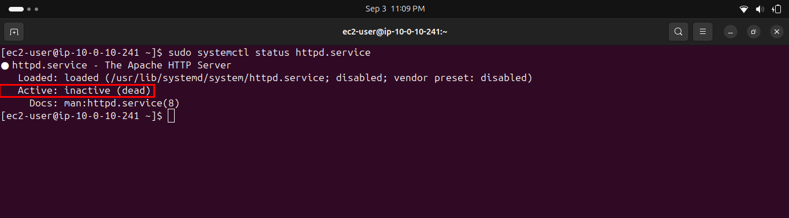
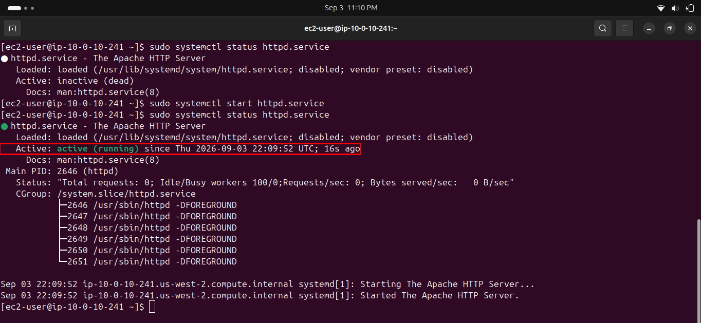
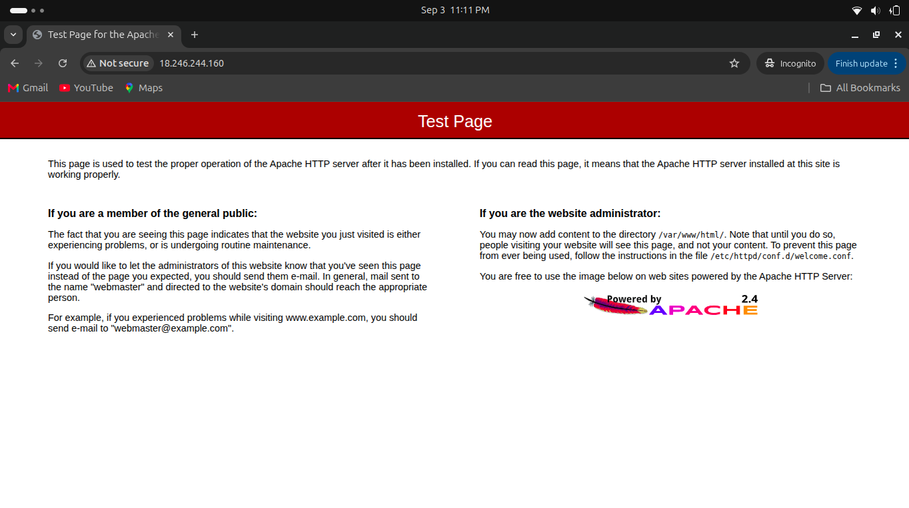
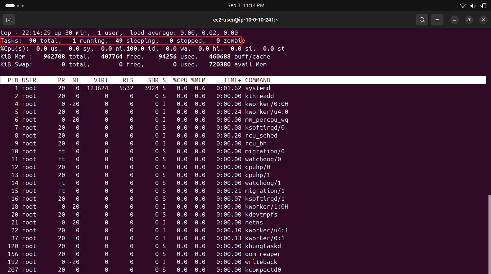
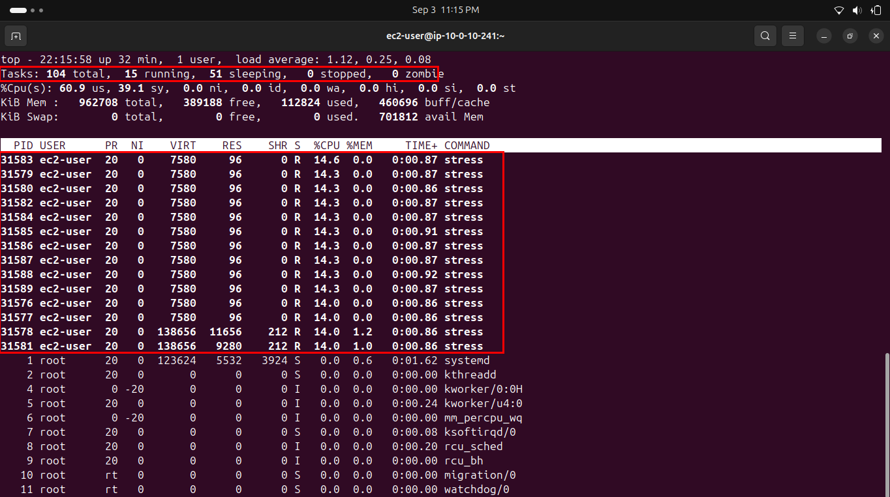
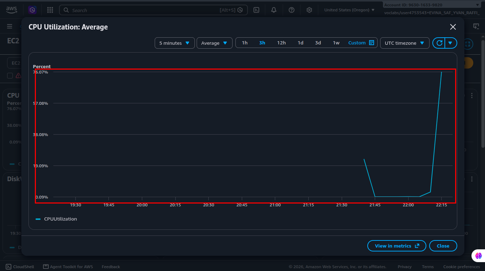

# Lab 241 — Managing Services & Monitoring

**Module**: Linux
**Date**: 2026-09-03
**Objective**: Check and start the httpd service, verify it over HTTP, then monitor CPU load locally with top and remotely with CloudWatch.

## What I did

Checked the httpd service status with `systemctl`, initially inactive.



Started the service and confirmed it was active and running, serving requests.



Verified the server was reachable by visiting `http://<public-ip>` in a browser, which returned the Apache test page.



Ran `top` under normal conditions as a baseline: 90 tasks total, 1 running.



Ran `./stress.sh & top` to simulate CPU load, observing 15 running tasks and multiple `stress` processes each consuming around 14% CPU, with `%Cpu(s)` jumping to 60.9% user time.



Opened the CloudWatch EC2 automatic dashboard and observed the CPU Utilization graph, which showed a clear spike up to 76.07% matching the timing of the stress test, before dropping back down.



## Key commands
```bash
sudo systemctl status httpd.service
sudo systemctl start httpd.service
sudo systemctl status httpd.service
sudo systemctl stop httpd.service

top
./stress.sh & top
```

## Issue encountered
Before running this lab, I expected `stress.sh` might not exist on a personal AWS account instance, since re/Start labs sometimes pre-load scripts only in the official sandbox environment. In this case the script was present and worked as described, so this concern turned out to be a non-issue, worth checking for each new lab rather than assuming either way.

## Fix
Not applicable, verified the script's presence with `ls` before running it, and it worked as expected.
