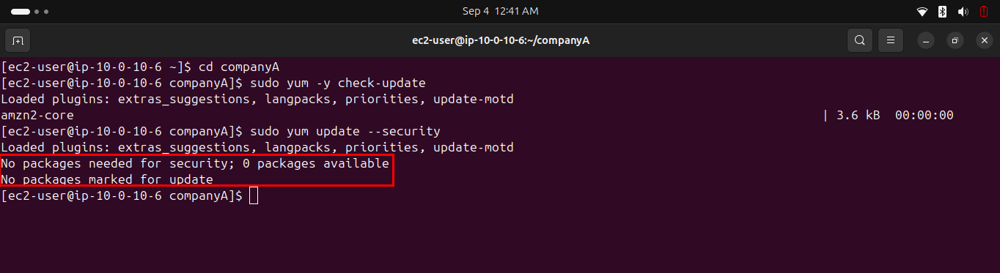
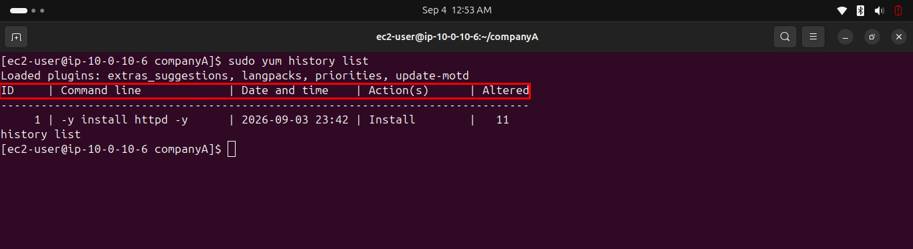
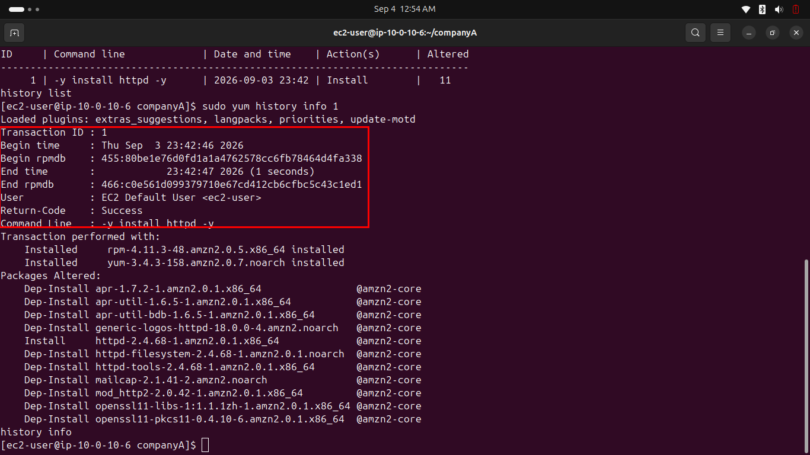
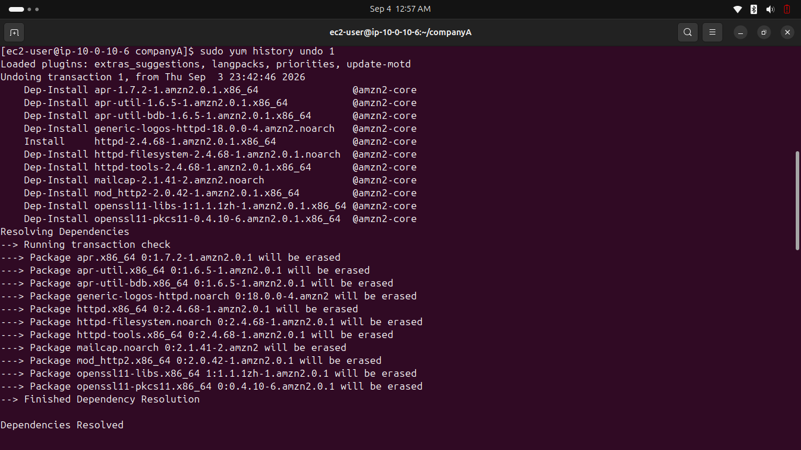
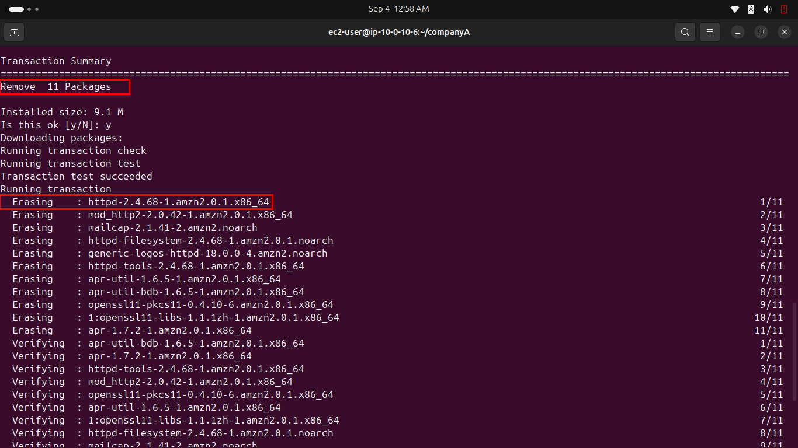
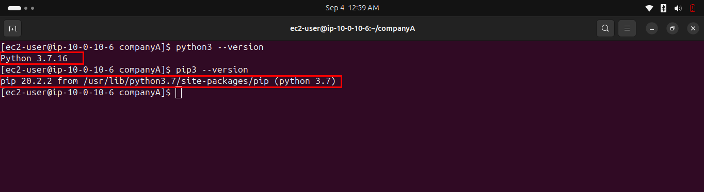
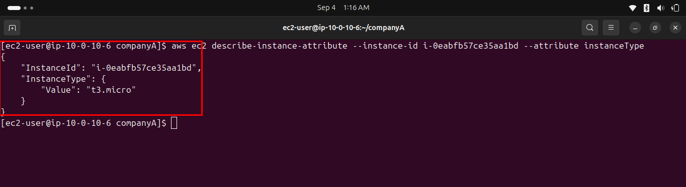

# Lab 243 — Software Management

**Module**: Linux
**Date**: 2026-09-03/04
**Objective**: Update the system via yum, roll back a package installation using yum history, and install and configure the AWS CLI.

## What I did

Checked for and applied security updates with `yum -y check-update` and `yum update --security`. No packages were available, the instance was already current.



Installed `httpd` with `yum install httpd -y`, pulling in its dependencies (apr, mod_http2, openssl11-libs, etc.).

Reviewed the transaction history with `yum history list`, identifying transaction ID 1 as the httpd install (11 packages altered).



Inspected the full detail of that transaction with `yum history info 1`.



Rolled back the installation with `yum -y history undo 1`.



Confirmed the rollback completed, removing all 11 packages installed by that transaction.



Verified Python and pip versions before installing the AWS CLI.



Downloaded and installed the AWS CLI v2 via `curl` and the official installer, then verified it with `aws help`.

Configured the CLI with `aws configure` and the sandbox-provided credentials, then confirmed it worked by describing the instance's type.



## Key commands
```bash
sudo yum -y check-update
sudo yum update --security
sudo yum -y upgrade
sudo yum install httpd -y

sudo yum history list
sudo yum history info 1
sudo yum -y history undo 1

python3 --version
pip3 --version

curl "https://awscli.amazonaws.com/awscli-exe-linux-x86_64.zip" -o "awscliv2.zip"
unzip awscliv2.zip
sudo ./aws/install
aws help

aws configure
aws ec2 describe-instance-attribute --instance-id <instance-id> --attribute instanceType
```

## Issue encountered
The instructions present `pip` as "the primary distribution method for the AWS CLI", checking `pip3 --version` right before installing, but then never actually use pip. The install itself uses the official `curl` + `awscliv2.zip` + `sudo ./aws/install` method, which is the currently correct approach. The pip references appear to be leftover from an older version of this lab.

Since this lab handles real (temporary) AWS credentials from the Vocareum sandbox, care was taken not to capture `~/.aws/credentials` or any command output containing the access key or secret key, even though they are session-scoped, to avoid publishing live credentials to a public GitHub repo.

## Fix
Followed the actual working install steps (curl-based) rather than the pip references. Redacted or excluded any screenshot that would have exposed AWS credentials.
