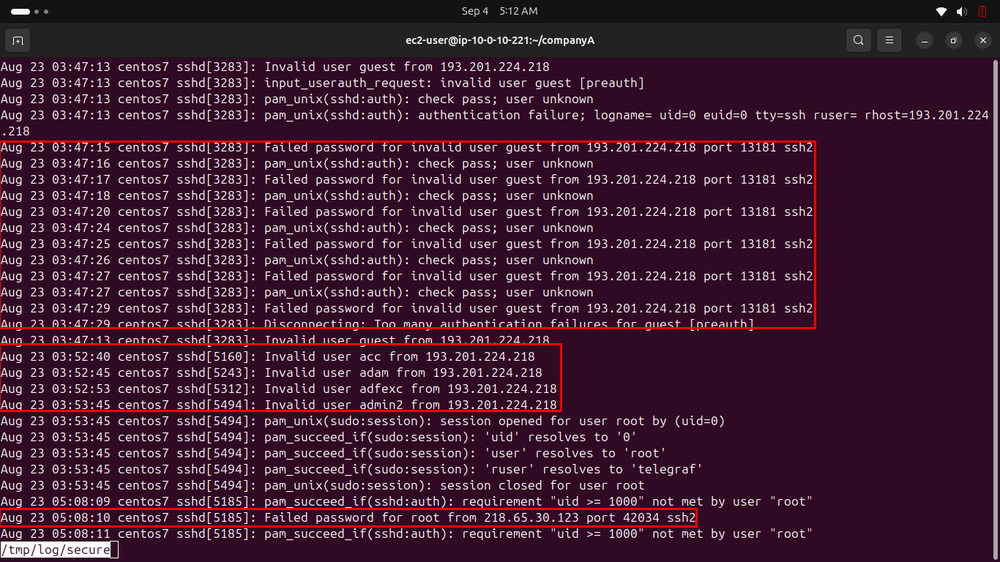
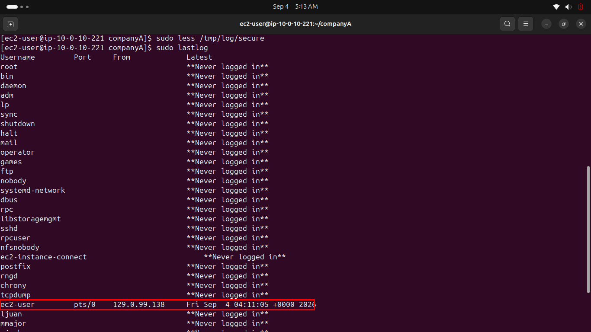

# Lab 245 — Managing Log Files

**Module**: Linux
**Date**: 2026-09-04
**Objective**: Review a sample secure log file and check user login history with lastlog.

## What I did

Reviewed the sample secure log with `less /tmp/log/secure`. The log showed a clear SSH brute-force pattern: repeated failed password attempts for a non-existent user "guest" from the same IP (193.201.224.218), followed by the same IP scanning through several other invalid usernames (acc, adam, adfexc, admin2), and later a separate failed root login attempt from a different IP (218.65.30.123).



Checked login history for all system users with `sudo lastlog`. Nearly every account showed "Never logged in", except `ec2-user`, which showed a real, recent login.



## Key commands
```bash
sudo less /tmp/log/secure
sudo lastlog
```

## Additional challenge: business value of this data
This kind of log is directly actionable for security monitoring. The repeated failed logins for invalid usernames from a single IP is a textbook credential-stuffing/brute-force signature, in a real environment, this pattern would justify an automatic IP ban (via fail2ban or a security group rule) after a threshold of failures. Cross-referencing `lastlog` against the list of accounts actively targeted in the secure log also helps confirm that none of the targeted usernames (guest, acc, adam, etc.) correspond to real accounts on this system, meaning the attack had no chance of succeeding, useful evidence for an incident report.

## Issue encountered
None specific to this lab, it ran as documented, using the sample log at `/tmp/log/secure` instead of the real `/var/log/secure` as noted in the instructions.

## Fix
Not applicable.
