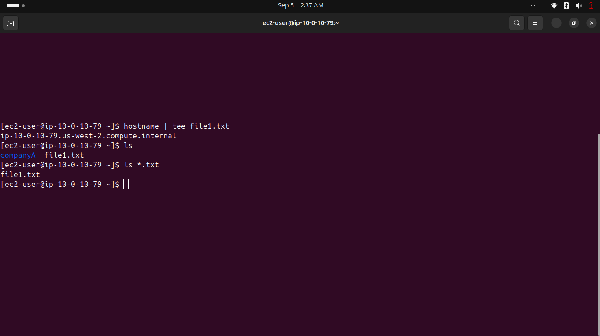
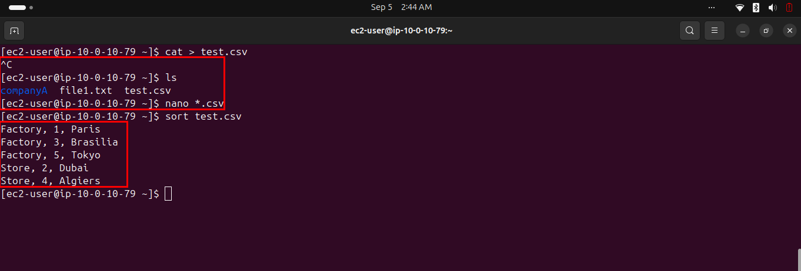
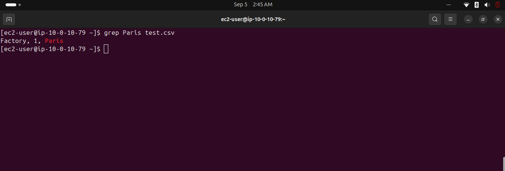
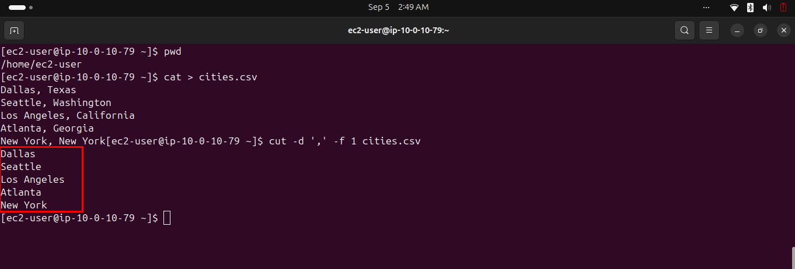
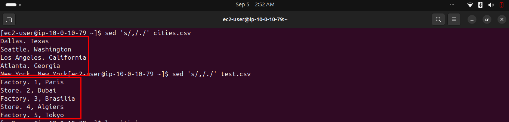

# Lab 247 — Working with Commands

**Module**: Linux
**Date**: 2026-09-05
**Objective**: Use tee, sort, grep, cut, and sed to manipulate text files and their content.

## What I did

Used `tee` to write the output of `hostname` to both the screen and a file, then verified it with `ls`.



Created `test.csv`, then sorted its content with `sort test.csv`, which grouped and ordered entries alphabetically then numerically.



Searched for the "Paris" entry with `grep Paris test.csv`.



Created `cities.csv`, then extracted the first field of each line with `cut -d ',' -f 1 cities.csv`.



Additional challenge: used `sed 's/,/./'` to replace the first comma with a period in both `cities.csv` and `test.csv`.



## Key commands
```bash
hostname | tee file1.txt
ls

cat > test.csv
sort test.csv
grep Paris test.csv

cat > cities.csv
cut -d ',' -f 1 cities.csv

sed 's/,/./' cities.csv
sed 's/,/./' test.csv
```

## Issue encountered
The instructions gave `find | grep Paris test.csv` to search for "Paris". This command is misleading: when `grep` receives a filename argument, it reads directly from that file rather than from standard input, so the `find` output piped in is silently discarded. The command still produces the correct result, but only because `grep Paris test.csv` alone would have been sufficient, the `find` adds nothing and the instructions' explanation of how it works is incorrect.

The first attempt at `cat > test.csv` was interrupted with `Ctrl+C` before the content was fully entered, `nano *.csv` was used instead to populate the file correctly.

Separately, comparing the `sort test.csv` output (grouped and ordered) against the later `sed` output on the same file (still in original creation order) confirms that `sort` without the `-o` flag never modifies the source file, it only prints the sorted result to the terminal.

## Fix
Used `grep Paris test.csv` directly, dropping the unnecessary `find`. Used `nano` to recover from the interrupted `cat` session.
