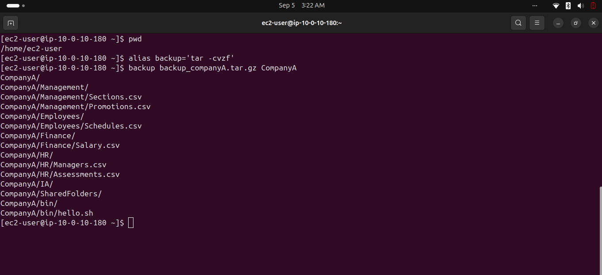
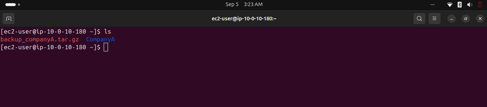
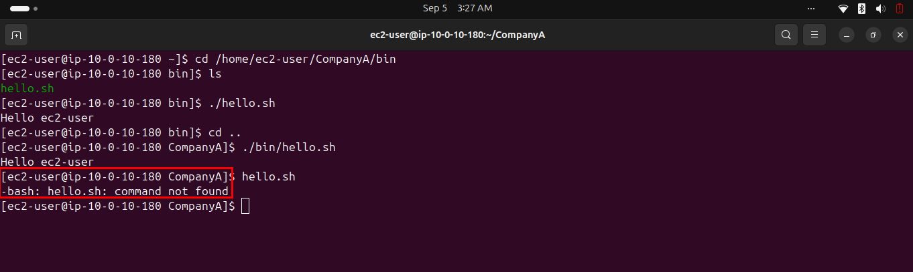
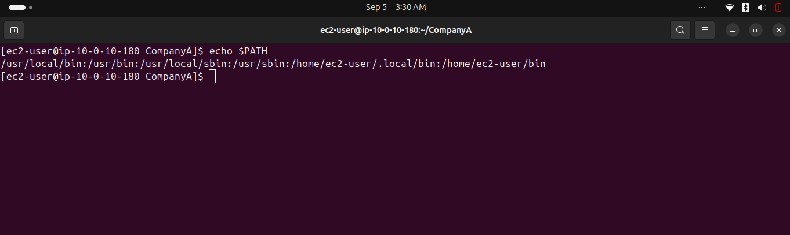
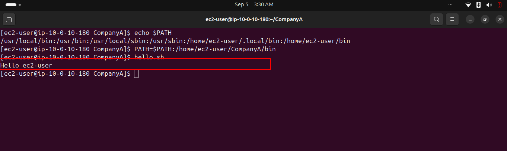

# Lab 249 — The Bash Shell

**Module**: Linux
**Date**: 2026-09-05
**Objective**: Create a reusable alias for backups, and understand how the PATH variable determines which commands can be run by name.

## What I did

Created a `backup` alias wrapping `tar -cvzf`, then used it to archive the `CompanyA` folder.



Verified the archive was created alongside the original folder.



Tested three ways of running `hello.sh`: with an explicit relative path from inside `bin/` (`./hello.sh`), with a relative path from the parent folder (`./bin/hello.sh`), both of which worked, and by name alone (`hello.sh`), which failed with "command not found".



Checked the `PATH` variable, which already contained an unrelated `/home/ec2-user/bin` entry, not the actual script location (`/home/ec2-user/CompanyA/bin`).



Added the correct folder to `PATH`, after which `hello.sh` ran successfully by name from anywhere.



## Key commands
```bash
alias backup='tar -cvzf '
backup backup_companyA.tar.gz CompanyA
ls

cd /home/ec2-user/CompanyA/bin
./hello.sh
cd ..
./bin/hello.sh
hello.sh

echo $PATH
PATH=$PATH:/home/ec2-user/CompanyA/bin
hello.sh
```

## Issue encountered
The `bin/hello.sh` script referenced in the lab did not exist and had to be created manually before starting.

The instructions also contain a factual error: they claim Bash looks in "the current folder and then in all the folders contained in PATH" when resolving a bare command name. This is incorrect, Bash never searches the current directory automatically for security reasons (unlike Windows), which is precisely why `./hello.sh` requires an explicit path while a bare `hello.sh` fails until its folder is added to PATH.

## Fix
Created the missing `bin/hello.sh` script before starting the lab. Relied on the actual observed behavior (explicit path always required unless the folder is in PATH) rather than the incorrect explanation given in the instructions.
